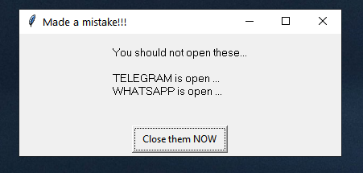
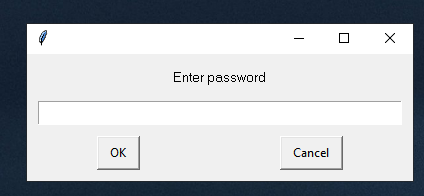

# AppCloser: you can close apps when you are not behind your system
You can restrict some sensitive applications that you do not want to be opened when you are not using your system.

This code helps you close applications when someone else (when you are not using the system) and put the system on the lock screen, and after three attempts, this script will put your system on sleep mode.

Furthermore, you can combine this script with a telegram bot and activate it remotely. 



 
 
## Install

### Dependencies

You need the following dependencies:

- python3
- ctypes
- pyautogui


### Install the repo and the requirements

Clone the repo and install 3rd-party libraries.

```bash
$ git clone https://github.com/Kianoush-h/AppCloser.git
$ cd AppCloser
$ pip3 install -r requirements.txt
```

 
## Run the code

You can run the the code with this:

```
python3 AppCloser.py
```
After you run the code, the code starts observing the running apps and if it finds the restricted apps it goes as follows:

- Minimizes all the open windows
- Terminates the restricted apps
- Shows a warning message with windows message
- Asks for a password
- lock the screen
- Sends the system to the sleep mode after 3 failed attemps 


## CODE

Importing libraries 
 
 ```
import os
import pyautogui
from time import sleep
import ctypes
 ```
 
Restricted apps:
 
 ```
app1 = 'telegram'
app2 = 'whatsapp'
 ```

Message text:

```
pyautogui.alert(f'You should not open these...\n\n{apps}',
                            'Made a mistake!!!','Close them NOW',0)     
```


Password: 

```
Password = 'Kianoush'
while pyautogui.password('Enter password') != Password:
```


Minimizing all the opened windows:

```
pyautogui.keyDown('winleft')
pyautogui.press('d')
pyautogui.keyUp('winleft')
```

Clossing part:

```
os.system(f"TASKKILL /F /IM {app1}.exe")
os.system(f"TASKKILL /F /IM {app2}.exe")
```


 # Future 
 You can modify this project in a way that you can combine this script with a telegram bot and activate it remotely. 


# Contact Me

Email: haratiank2@gmail.com

YouTube channel: https://www.youtube.com/channel/UCvf9_53f6n3YjNEA4NxAkJA?view_as=subscriber

GitHub: https://github.com/Kianoush-h

LinkedIn: https://www.linkedin.com/in/kianoush-haratiannejadi/


